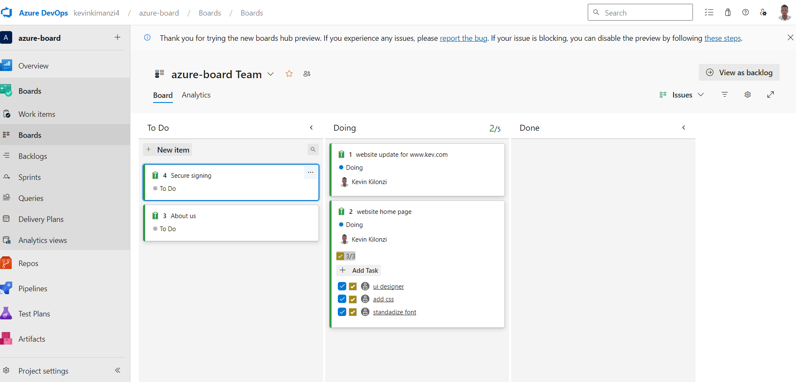
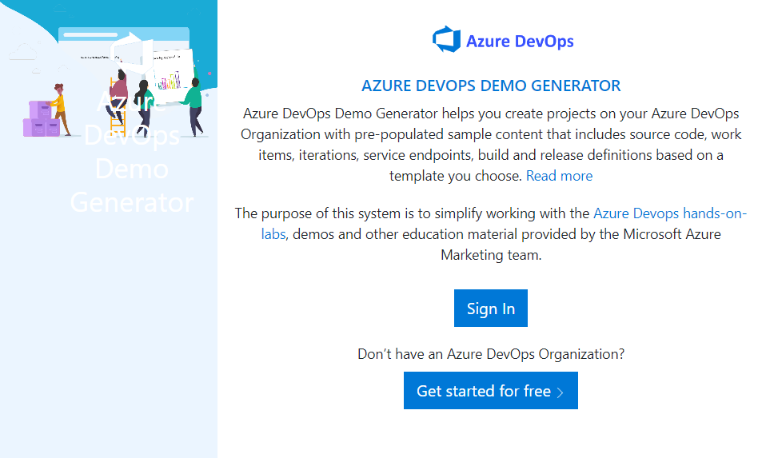

### CAPEX (CAPITAL EXPENDITURE)
Fund used by a company to acquire, upgrade and maintain physical assets

### OPEX (OPERATION EXPENDITURE)
Expenses that a business incurs through it's normal business operation

### Goal is to minimize CAPEX & OPEX, BUILD system that are highly available, highly scalable & free from failue.

## AGILE PROJECT MANAGEMENT
### Azure Board
##### Azure Boards
is a project managent tool that enables teams to plan, track, and discuss work across the entire development process, while it supports agile methodologies.

Create a basic azure board (Epic) with the following items:

         1. WEBSITE UPDATE

             TASKS:1.UI design

                   2.add css

                   3.standadize font

         2.CLOUD MIGRATION

         3.CICD IMPLEMENTATION

  
  
Board screenshot

 

I am going to practice Azure Boards and Agile Project Management using azure devops project generator

    
 
 Use these steps to load dummy data into your Azure DevOps project. We will use this data in the demo. 

Navigate to 
<a href=" https://azuredevopsdemogenerator.azurewebsites.net"> 

Azure devops demo generator</a>
 
This utility site will automate the creation of a new Azure DevOps project within your account that is prepopulated with content (work items, repos, etc.) required for the lab.

Sign in using the Microsoft account associated with your Azure DevOps subscription.

    
  

