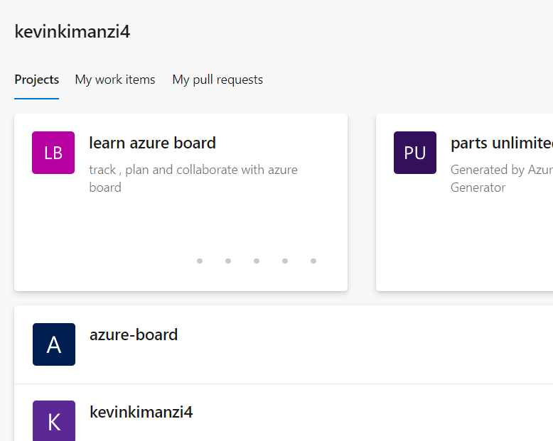
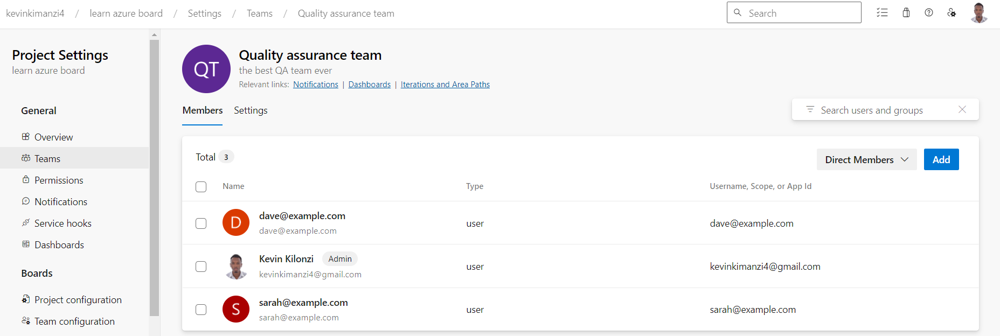

#### Create an Azure Devops Project 

##### Task 1: Introduction to Azure DevOps and Creating a new project.
###### project name: Learn Azure Board

##### Task 2:  Setting up Azure DevOps projects, creating teams, and inviting team members.

###### Create a quality assurance team and invite team members 

1.dave@example.com
2.sarah@example.com

 
 
#### Task 3: Creating and importing work items in Azure DevOps Boards.

#### Task 4: Customizing Azure DevOps Boards and filtering work items.

#### Task 5: Exploring Azure DevOps backlogs, and organizing workloads into sprints.